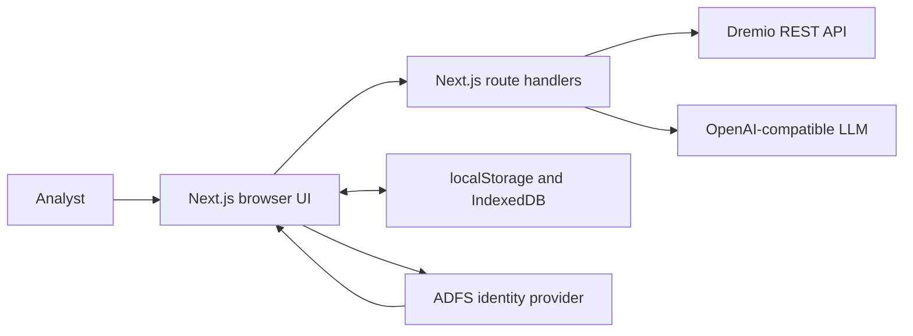
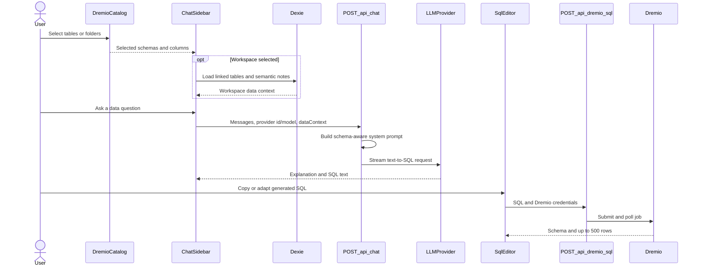
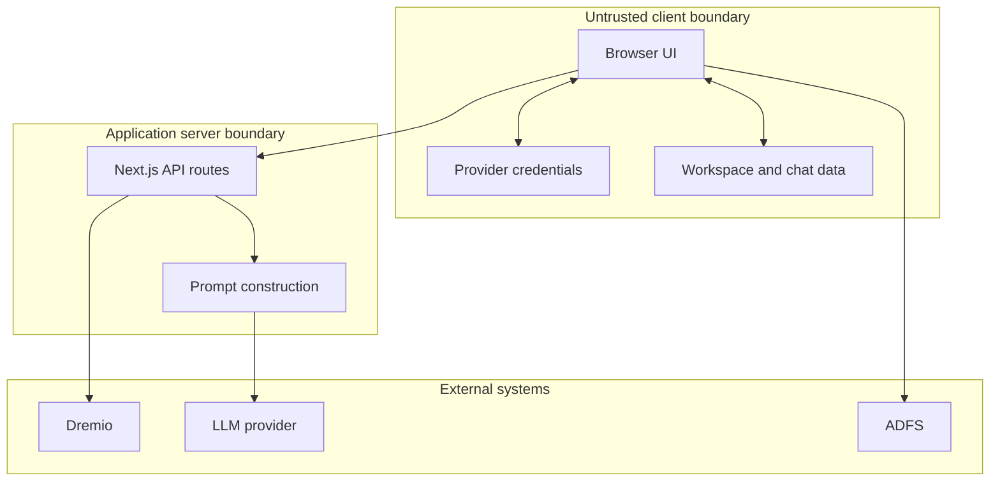
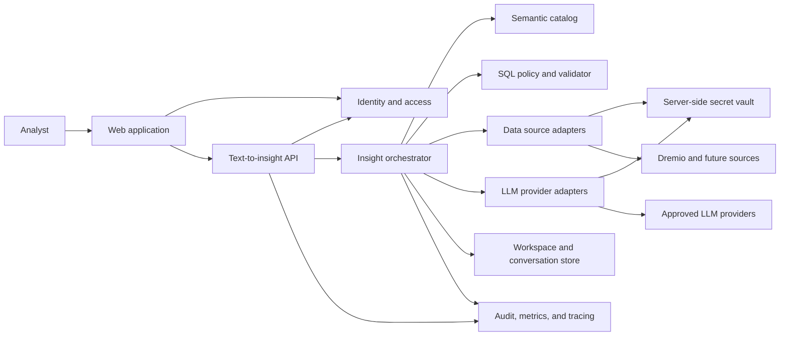
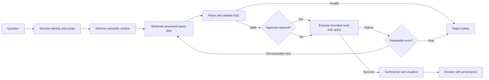

# Text-to-Insight Architecture

## Purpose

`ep.` is a text-to-insight workbench. It connects to a data source, gives an
LLM provider selected schema and business context, and helps a user discover
data and write analytical SQL.

This document distinguishes:

- **Current architecture**: behavior implemented in this repository.
- **Target architecture**: the production design toward which the product can
  evolve. Target components are proposals, not existing features.

## Product terminology

- **Data source**: the system that owns schemas and executes queries. Supabase
  is the environment-backed default for RLS-governed catalog browsing and
  schema context; manual Dremio or Postgres credentials are required for
  arbitrary SQL execution.
- **LLM provider**: OpenCode Zen when `OPENZEN_API_KEY` is configured, with a
  browser-configured OpenAI-compatible endpoint as the fallback.
- **Data context**: selected tables, columns, folders, and workspace notes sent
  to the SQL assistant.
- **Workspace**: a browser-local collection of linked tables and semantic notes.
- **Text-to-SQL**: generation of SQL from a natural-language request plus data
  context.
- **Insight**: an explanation, query, result summary, or visualization
  produced from governed data.
- **Focus**: the separate prototype on `/chat` that creates mock tabular data
  and chart specifications. It is not connected to Dremio.

## System context

The Next.js application is both the web client and a thin server-side proxy.
There is no Convex backend or durable agent runtime. A Supabase/Postgres schema
contains public synthetic investment datasets. The Next.js product discovers
that catalog through the Supabase PostgREST OpenAPI document using the public
publishable key. Browser-local Dexie remains the application store for
workspaces and conversations.

## Current architecture

### Runtime layers

| Layer | Responsibilities | Primary implementation |
| --- | --- | --- |
| Product shell | SQL workbench layout, catalog selection, chat sidebar | `app/page.tsx` |
| Data exploration | Browse Dremio catalog and load dataset columns | `components/dremio-catalog.tsx`, `app/api/dremio/catalog/route.ts` |
| Query execution | Edit SQL, submit a Dremio job, poll, return up to 500 rows | `components/sql-editor.tsx`, `app/api/dremio/sql/route.ts` |
| Schema-aware chat | Build `dataContext`, stream assistant responses | `components/chat-sidebar.tsx`, `app/api/chat/route.ts` |
| Supabase data Q&A | Validate model-created read plans, fetch bounded RLS-governed rows, answer with source names, and stream catalog-constrained json-render charts | `lib/supabase/data-qa.ts`, `lib/ai/investment-insight-catalog.ts`, `app/api/chat/route.ts`, `app/api/chatbot/route.ts` |
| Model discovery | List normalized OpenCode Zen models without exposing the server key; select a model in both chat surfaces | `app/api/models/route.ts`, `lib/ai/openzen.ts`, `components/model-selector.tsx` |
| Semantic notes | Workspaces, linked tables, table notes, column notes | `app/workspaces/page.tsx`, `lib/db.ts`, `lib/use-workspace.ts` |
| Credentials | Configure Dremio, OpenAI-compatible, and ADFS values | `components/credential-settings.tsx`, `lib/credential-store.ts` |
| General chat and Focus | Generic chat plus mock data/chart workflow | `app/chat/page.tsx`, `app/api/chatbot/route.ts`, `app/api/focus/*` |
| SSO experiment | OIDC discovery and authorization-code exchange | `app/sso/page.tsx`, `app/api/adfs/*` |
| Synthetic investment data | Default read-only Supabase catalog, schema context, seed, provenance registry, RLS, and analytical views | `app/api/supabase/catalog/route.ts`, `supabase/migrations/*`, `supabase/seed.sql` |

### Browser state

`lib/credential-store.ts` stores manual provider configuration under
`ep_credentials` in `localStorage`. Those values are sent in request bodies
only when the OpenCode Zen server default is unavailable. The selected Zen
model id is stored separately in local storage; `OPENZEN_API_KEY` remains on
the server. ADFS access tokens are stored in `sessionStorage`.

`lib/db.ts` creates the Dexie database `ep-workspace-notes` with:

- `workspaces`
- `linkedTables`
- `tableNotes`
- `columnNotes`
- `chatConversations`
- `chatMessages`

This state is tied to one browser profile. It is not synchronized, shared,
backed up, or protected by server-side authorization.

### Canonical text-to-SQL flow

Important: Dremio chat generation and SQL execution remain separate user
actions. In Supabase mode, the server can execute only a bounded structured
PostgREST plan over selected public investment tables. The model does not
receive arbitrary SQL execution access.

### Context construction

`components/chat-sidebar.tsx` chooses one context source:

1. With an active workspace, it loads linked tables and notes from Dexie.
2. Without a workspace, it uses checked catalog items and their loaded columns.

The component sends this as `dataContext` to `/api/chat`.
`app/api/chat/route.ts` serializes it into model instructions and calls the
selected model through the Vercel AI SDK. When OpenCode Zen is configured,
`/api/models` discovers its catalog with the server-only key and the chat route
validates the selected model against that catalog. The provider adapter chooses
Responses, Anthropic Messages, Google Generative AI, or Chat Completions based
on the documented Zen protocol for that model family.

This is prompt injection of selected metadata, not retrieval-augmented
generation:

- no ingestion or chunking pipeline
- no embeddings
- no vector index
- no relevance retrieval
- no context ranking or token-budget policy

For Supabase data questions, selected table metadata also forms a strict
allowlist. A first model call proposes up to 3 single-table read plans. The
server validates every table, column, filter, sort, and limit, executes the
plans with the publishable key under RLS, bounds returned data, and supplies
those rows to the final answer call. Answers identify their source tables and
state that the data is synthetic.

### Dremio integration

- `POST /api/dremio/catalog` proxies catalog and dataset metadata requests.
- `POST /api/dremio/sql` submits SQL to `/api/v3/sql`, polls the Dremio job for
  at most roughly 60 seconds, and requests the first 500 result rows.
- The Dremio personal access token is supplied by the browser on every request.
- Disabling TLS certificate verification is supported for internal development
  endpoints. It weakens transport security and should not be enabled in
  production.

The JDBC and ODBC tester components validate connection-string formats only.
They do not open database connections.

### Other AI flows

The product currently has two independent chat experiences:

- The SQL assistant sidebar on `/` receives Dremio schema context.
- `/chat` uses `/api/chatbot` for general chat and `/api/focus/*` for the Focus
  workflow.

Both surfaces use OpenCode Zen by default when `OPENZEN_API_KEY` is present and
show a server-discovered model selector. If the environment key is absent or
discovery fails, the existing browser-configured OpenAI-compatible provider is
used instead.

Both chat routes forward reasoning parts when the selected model provides them.
The two chat surfaces consolidate those parts into one collapsible Thinking
block that stays open until the first answer text or renderable json-render
spec is visible. Chat generation requests low reasoning effort where the
provider supports it. Long reasoning remains height-limited inside the block
unless the user explicitly expands it.

When a governed Supabase plan returns rows, both chat routes deterministically
map those verified rows into a validated json-render specification and append
it to the answer stream. The investment insight catalog limits output to cards,
metrics, bar/line charts, and tables, which render through application-owned
React components. Empty results remain text-only. The model produces the
written answer, not the visualization tree, and no generated React or
JavaScript is executed.

Successful SQL execution in the workbench also forwards its bounded rows to the
chat sidebar, which immediately appends a validated json-render visualization.
There is no separate report action or report-generation endpoint.

Focus asks an LLM to produce data and chart specifications. Its run
stage uses generated or fallback mock rows and does not execute code or SQL
against Dremio. Do not treat Focus output as a live-data insight.

### Deployment

The application can run as a Next.js Node.js service using the included
`Dockerfile` and Kubernetes manifests. GitLab/sample deployment assets are
infrastructure helpers; they do not change the runtime data flow described
above.

The configured Supabase development project also contains deterministic
synthetic market, macro/rates, asset-management, and responsible-investing
subject areas. Anonymous and authenticated PostgREST clients can read only
datasets marked public and synthetic through row-level security. No client
write policies exist. The workbench uses this path for zero-configuration
catalog discovery and schema-aware chat context. PostgREST does not expose
arbitrary SQL, so query execution still requires a manually configured
Postgres or Dremio connection.

## Current trust boundaries and risks

Key risks:

1. **Client-controlled credentials and context**: route handlers trust provider
   endpoints, keys, and schema context supplied by the browser.
2. **No application authorization**: the ADFS experiment does not gate routes
   or map a user to permitted data sources.
3. **Broad proxy behavior**: user-controlled outbound endpoints and optional
   TLS bypass require SSRF controls, allowlists, timeouts, and egress policy.
4. **Prompt injection**: catalog descriptions, notes, and model responses are
   untrusted content.
5. **Unsafe generated SQL**: generated SQL has no parser-based read-only policy,
   cost estimate, approval gate, or automatic limit enforcement.
6. **Local-only governance**: workspaces and chat history have no shared
   ownership, audit trail, retention policy, or recovery.
7. **Observability exposure**: logs must not include credentials, full prompts,
   sensitive schema, or result values.

## Target production architecture

### Design principles

1. Keep data in the source; retrieve only the bounded rows needed for an answer.
2. Enforce identity, source permissions, and query policy before model or data
   access.
3. Treat natural language, metadata, generated SQL, and model output as
   untrusted.
4. Separate provider-neutral orchestration from connector-specific adapters.
5. Make query generation, approval, execution, and insight production visible
   and auditable.
6. Prefer deterministic validation and typed contracts around probabilistic
   model calls.

### Logical components

### Component contracts

#### Identity and access

- Authenticate every application request.
- Resolve the user and organization to allowed connections, schemas, and
  actions.
- Apply source-native identity delegation where possible; otherwise use scoped
  service credentials with application authorization.
- Never accept arbitrary provider URLs or durable secrets from an untrusted
  request in production.

#### Data source adapters

Expose a provider-neutral interface such as:

- `testConnection`
- `listCatalog`
- `describeDataset`
- `validateQuery`
- `estimateQuery`
- `executeReadOnlyQuery`
- `cancelQuery`

The first adapter wraps the existing Dremio REST behavior. Future adapters can
support other HTTP-accessible analytical engines. JDBC/ODBC requires a
separate server runtime or connector service and must not be represented as
working until it opens and verifies a real connection.

#### Semantic catalog

Persist source metadata, business descriptions, joins, metrics, owners, and
freshness separately from raw result data. Refresh metadata asynchronously and
track its source and age.

For a small selected schema, direct structured context is sufficient. Add
retrieval only when the catalog exceeds prompt limits: retrieve relevant
metadata and examples using lexical and/or vector search, then cite the
selected context. RAG is an optional scaling technique, not a prerequisite for
text-to-SQL.

#### LLM provider adapters

Normalize model selection, streaming, structured output, usage, retries, and
timeouts behind one interface. Provider credentials come from the server-side
vault. Use validated structured output for query plans instead of extracting
SQL from arbitrary markdown.

#### Insight orchestrator

Use an explicit state machine:

The approval branch is policy-driven: expensive, sensitive, or broad queries
require explicit user confirmation. Automatic repair has a strict retry limit
and receives sanitized database errors only.

#### SQL policy and execution

- Parse SQL with a dialect-aware parser.
- Permit read-only statements and approved functions only.
- Resolve every referenced object against the authorized catalog.
- Block comments or constructs that bypass policy.
- Add or enforce row limits and execution timeouts.
- Estimate cost when the source supports it.
- Cancel abandoned work.
- Return typed columns, bounded rows, truncation metadata, query ID, and timing.
- Redact sensitive columns before model summarization.

#### Persistence and observability

Store user-scoped connections, workspaces, semantic notes, conversations, query
runs, approvals, and feedback in a durable application database. Store secret
references rather than plaintext credentials.

Emit correlated events for question, context selection, model call, validation,
approval, query execution, and answer. Record model/provider versions and
token/query usage without logging secrets or unrestricted data values.

## Target request flow

1. Authenticate the user and resolve an authorized connection.
2. Classify the request as metadata discovery, query generation, result
   analysis, or general help.
3. Retrieve only authorized semantic context relevant to the question.
4. Ask the configured model for a typed query plan containing SQL, assumptions,
   referenced objects, and explanation.
5. Parse and validate the SQL against access and cost policies.
6. Request approval when policy requires it.
7. Execute through the source adapter with read-only credentials and hard
   limits.
8. Sanitize and summarize bounded results; build a declarative chart spec when
   useful.
9. Return the answer with SQL, source/query ID, context provenance, warnings,
   and truncation status.
10. Persist the auditable run and collect user feedback.

## Extension points

- **New data source**: implement the connector interface and source-specific
  SQL dialect policy; do not branch provider logic throughout UI components.
- **New LLM provider**: implement the provider adapter and capability metadata;
  keep orchestration contracts unchanged.
- **New semantic source**: add an importer into the semantic catalog with
  provenance and refresh rules.
- **New visualization**: produce a validated declarative chart specification;
  never execute model-generated React or JavaScript.
- **New agent step**: add a bounded state transition with typed input/output,
  authorization, telemetry, and a defined failure path.

## Migration path

### Phase 1: Make the current boundary explicit

- Share Zod contracts across UI and route handlers.
- Centralize Dremio and LLM client code behind adapters.
- Add timeouts, endpoint allowlists, request-size limits, and secret-safe logs.
- Add route integration tests for catalog, SQL, and schema-aware chat.

### Phase 2: Add identity and durable product state

- Gate application routes with real authentication and authorization.
- Move provider configuration to server-side connection records and a secret
  vault.
- Move workspaces, notes, conversations, and feedback from Dexie to a
  user-scoped durable store; use Dexie only as an optional cache.

### Phase 3: Close the text-to-insight loop

- Return structured query plans from the model.
- Add SQL parsing, read-only policy, limits, approval, execution, cancellation,
  and provenance.
- Summarize real bounded Dremio results and replace mock Focus data for live
  insight flows.

### Phase 4: Scale context and governance

- Add catalog synchronization, lineage, metrics, sensitivity labels, and
  context retrieval when scale requires it.
- Add evaluation datasets for SQL correctness, policy compliance, answer
  groundedness, latency, and cost.
- Add organization administration, audit review, retention, and provider/source
  health monitoring.

## Invariants for contributors

- Do not describe the current product as RAG or an autonomous query agent.
- Do not imply that Focus, JDBC, or ODBC uses live data.
- Keep generated SQL and executed SQL distinguishable in UI and telemetry.
- Never log or commit provider keys, Dremio PATs, tokens, or `.env.local`
  values.
- Never enable TLS bypass as a production default.
- Any automatic execution path must enforce authentication, authorization,
  read-only SQL validation, bounded results, and audit events.
- Update this document when a change alters a trust boundary, canonical flow,
  integration contract, or stated limitation.
