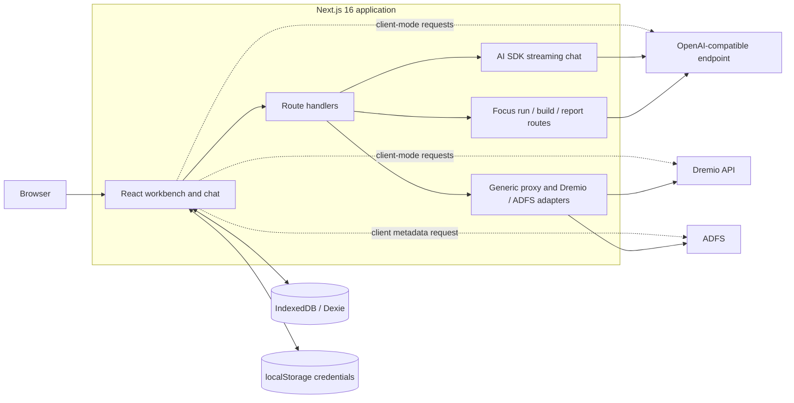
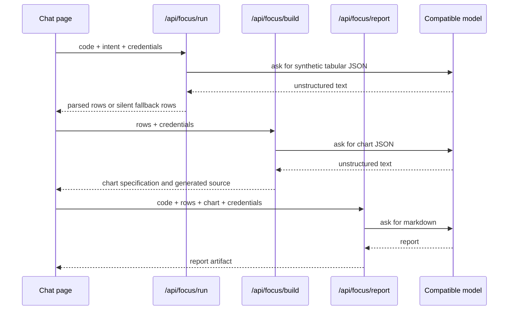
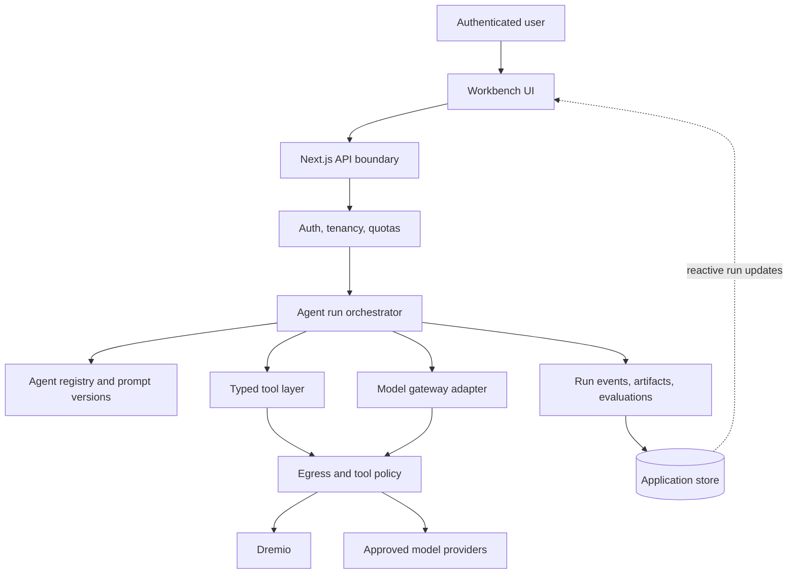
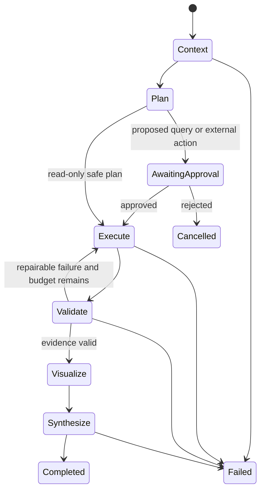

# ep Architecture and Agentic Workflow

## Purpose

`ep` is a Next.js workbench for testing endpoints, exploring Dremio, writing SQL, and using OpenAI-compatible models. This document records the current architecture, the main risks found during the repository sweep, and an incremental target architecture for turning the existing linear AI features into a reliable agentic workflow.

The target keeps two useful product constraints:

- users may connect to private Dremio and OpenAI-compatible endpoints;
- the application must remain deployable as a standalone container, without requiring a specific model vendor or hosting platform.

## Current architecture



### Runtime boundaries

| Boundary | Responsibility | Current location |
| --- | --- | --- |
| Browser UI | SQL editor, catalog browser, endpoint testers, chat, Focus UI | `app/page.tsx`, `app/chat/page.tsx`, `components/` |
| Browser persistence | Workspaces, notes, linked tables, conversations, credentials | `lib/db.ts`, `lib/credential-store.ts` |
| Provisioned persistence (not wired into runtime) | PostgreSQL schema and Windows/offline provisioning for user-scoped workspaces and chat | `db/provision/schema.sql`, `db/provision/` |
| Next.js BFF | Validates some requests and relays calls to external systems | `app/api/` |
| AI chat | Streams text from a user-selected compatible model | `app/api/chat/route.ts`, `app/api/chatbot/route.ts` |
| Focus workflow | Produces mock rows, a chart specification, and an insights report | `app/api/focus/{run,build,report}/route.ts` |
| Dremio integration | Catalog discovery and SQL job polling | `app/api/dremio/` |
| Packaging | Standalone Node container and Kubernetes manifests | `Dockerfile`, `k8s/`, `.github/workflows/` |

The API and OpenAI testers can deliberately call targets directly from the browser, and the ADFS tester can fetch metadata directly. Client mode is useful for reproducing CORS behavior, but it bypasses server-side egress policy, audit, quotas, and redaction. The UI must make that trust-boundary change explicit.

### Current Focus sequence



This is a multi-step model pipeline, but it is not yet a true agent runtime. The browser owns orchestration, each route contains its own provider client, there is no durable run state, and model outputs are parsed from arbitrary text.

## Findings from the sweep

### What is working well

- The application has a clear browser/BFF split and is already packaged as a non-root standalone container.
- AI SDK 6 streaming and part-based message rendering are in use.
- The text-only chat transport is simple and broadly compatible with custom providers.
- Focus request and response payloads use Zod contracts in `lib/focus-types.ts`.
- Dremio job polling, workspace notes, and selected schema context provide useful foundations for data tools.
- The UI exposes each Focus stage and its raw model response, which is useful for debugging.
- Existing chart rendering consumes a constrained chart specification rather than evaluating model-generated React code.

### Highest-priority risks

1. **Unrestricted server-side request forgery (SSRF).** `app/api/proxy/route.ts` accepts an arbitrary URL and headers. The Dremio, ADFS, and model routes also accept arbitrary hosts. In a shared deployment, a caller could reach internal services or cloud metadata endpoints.
2. **No authentication or authorization boundary.** Public route handlers can trigger outbound requests and model usage. There is no user, tenant, role, quota, or ownership model.
3. **Long-lived secrets in browser storage.** Dremio PATs, model keys, and ADFS client secrets are stored in `localStorage`, where any successful script injection can read them.
4. **TLS verification can be disabled broadly.** Several routes create an `undici` agent with `rejectUnauthorized: false`; one ADFS route does this unconditionally. This should be an explicit, audited development policy, not a per-request production capability.
5. **Client-owned orchestration is fragile.** Refreshing or closing the tab loses Focus progress. A partial failure requires restarting manually, and the server cannot enforce a consistent policy across steps.
6. **Synthetic output is presented as a run result.** `/api/focus/run` asks a model to invent rows. On parse failure it silently returns a fixed dataset with HTTP 200. This can make fabricated evidence appear successful.
7. **Repeated provider code.** URL normalization, TLS handling, request construction, response parsing, and error mapping are duplicated across chat and Focus routes.
8. **Weak structured generation.** Several agents request “ONLY JSON” and then use `JSON.parse`. AI SDK 6 can request schema-constrained output from compatible providers, while all providers still require strict local validation.
9. **Limited operational controls.** There are console metrics for chat, but no correlation ID, structured trace, retry policy, idempotency key, rate limit, cost budget, or evaluation suite.
10. **Large mixed-responsibility client module.** `app/chat/page.tsx` combines persistence, transport, workflow orchestration, parsing, metrics, settings, and multiple major views. This raises regression risk.
11. **Known dependency exposure.** The locked production tree currently reports 17 audit findings (7 high), including Next.js, `undici`, PostCSS, and transitive rendering/parser dependencies. `npm ci` also warns that Next.js 16.0.7 is affected by a published security issue.
12. **Lint is not operational.** `npm run lint` fails while loading the legacy `FlatCompat` configuration under ESLint 9, so regressions are not currently checked even though lint is declared as a project script.
13. **Dremio SQL is unrestricted.** `app/api/dremio/sql/route.ts` accepts arbitrary statements without read-only or single-statement enforcement. It also recognizes only three nonterminal job states, and the stored `projectId` is not applied to requests.
14. **Model data egress is implicit.** Code, workspace notes, catalog metadata, and sampled rows can be sent to any user-selected model host without classification, minimization, redaction, or an explicit disclosure gate.
15. **Provider URL behavior is inconsistent.** The model-test route can append a second `/v1`, while chat routes do not all honor `urlMode`. A connection can test successfully in one feature and fail in another.
16. **Chat loses rich agent events.** `TextStreamChatTransport` and `toTextStreamResponse()` expose text, but not typed tool parts, provider usage, finish reasons, or approval events. A future agent UI needs the UI-message protocol or the separate normalized event stream proposed below.
17. **Split Kubernetes manifests do not compose.** `k8s/service.yaml` selects `app: connection-tester`, while `k8s/deployment.yaml` labels pods `app: ep`. Applying them individually produces a Service with no endpoints; `k8s/all-in-one.yaml` uses the matching selector.
18. **SQL-assistant context is unbounded.** Selected schemas and notes are interpolated directly into the SQL system prompt without a token budget, and detailed table paths are written to application logs.
19. **AI surfaces have diverged.** `app/api/chat/report/route.ts` has no caller, while Focus uses a separate report route. Keeping unused, duplicated agent endpoints increases policy and prompt drift.
20. **Delivery checks and runtime health are incomplete.** Image pipelines do not gate on tests, types, lint, or audits. Kubernetes probes use the full `/` page instead of a lightweight health endpoint, and fixed 512 MiB limits have not been validated against concurrent 60-second AI requests.

## Target architecture



### Recommended module boundaries

```text
app/
  api/
    agent-runs/route.ts              # start/list runs
    agent-runs/[runId]/route.ts      # status, cancel, resume
    agent-runs/[runId]/events/route.ts
    chat/route.ts                    # thin streaming adapter
    dremio/...                       # thin validated adapters
components/
  chat/                              # conversation UI
  focus/                             # focus editor and artifact views
  agent-runs/                        # timeline, approvals, retry controls
lib/
  client/
    agent-runs.ts                    # typed browser API client
    credentials.ts                  # browser/session abstraction
  contracts/
    agent-run.ts                     # shared Zod schemas
    dremio.ts
    providers.ts
  server/
    agents/
      registry.ts                    # versioned agent definitions
      data-analyst.ts
      visualization.ts
      reporter.ts
      validator.ts
    orchestration/
      focus-workflow.ts              # state machine, not an HTTP handler
      runner.ts                      # retries, cancellation, budgets
    providers/
      openai-compatible.ts           # one model adapter
    tools/
      dremio-catalog.ts
      dremio-query.ts
      chart-spec.ts
    policy/
      egress.ts                      # URL/DNS/IP allowlist checks
      approvals.ts
      sql.ts                         # read-only SQL policy
    telemetry/
      trace.ts
      redaction.ts
```

Route handlers should only authenticate, validate, call an application service, and map the result to HTTP. Prompts, model configuration, retries, parsing, and business rules belong in server modules that can be tested without HTTP.

### Agent definition

Each agent should be a versioned, typed definition rather than an informal prompt embedded in a route:

```ts
interface AgentDefinition<TInput, TOutput> {
  id: string
  version: string
  description: string
  inputSchema: ZodType<TInput>
  outputSchema: ZodType<TOutput>
  execute(context: AgentContext, input: TInput): Promise<TOutput>
}
```

An `AgentContext` should carry only server-owned capabilities:

- authenticated actor and tenant;
- run and trace IDs;
- approved model profile, token/cost budget, and abort signal;
- typed tools allowed for that agent;
- redacted logger and artifact writer.

Do not pass arbitrary credentials, unrestricted `fetch`, or database clients directly to an agent.

## Proposed agentic workflow

The primary workflow should be evidence-driven:



1. **Context agent** selects the minimum relevant workspace notes and Dremio schema. Treat all catalog descriptions and row values as untrusted data, not instructions.
2. **Planner agent** produces a typed plan: objective, required datasets, intended tools, expected output, and risk level.
3. **Approval gate** is required for a new outbound host, non-read-only SQL, large scans, TLS bypass, or any action that can mutate data.
4. **Execution agent** calls typed tools. For analysis, use actual Dremio results when connected. Keep a clearly labelled `simulation` mode for synthetic rows.
5. **Validator agent** deterministically verifies SQL policy, row/column consistency, chart field references, row limits, and evidence coverage. Use a model critic only for semantic checks that code cannot perform.
6. **Visualization agent** returns only a validated chart specification. Rendering remains deterministic in `FocusChartRenderer`.
7. **Reporter agent** receives an evidence envelope containing the query, sampled results, warnings, and chart spec. It must cite artifact IDs or field names for material claims.

### Run contract

```ts
type AgentRunStatus =
  | "queued"
  | "planning"
  | "awaiting_approval"
  | "running"
  | "validating"
  | "completed"
  | "failed"
  | "cancelled"

interface AgentRun {
  id: string
  workflow: "focus-analysis"
  workflowVersion: string
  actorId: string
  workspaceId?: string
  status: AgentRunStatus
  currentStep?: string
  input: unknown
  artifacts: AgentArtifact[]
  attempts: AgentAttempt[]
  createdAt: string
  updatedAt: string
}
```

Persist state at every transition. An idempotency key should deduplicate “start run” requests, and each tool call should have a stable call ID. Retry only transient network/provider failures with bounded exponential backoff; validation failures should enter a bounded repair step, not a blind retry.

### Events and UI

Stream normalized run events rather than hard-coding three client fetches:

```text
run.created
step.started
tool.approval_required
tool.started
tool.completed
artifact.created
step.failed
run.completed
run.cancelled
```

The browser can render these as a timeline and reconnect by `runId`. The existing queue UI can become a projection of server-owned events instead of the source of truth.

## Persistence choice

The current Dexie store is appropriate for a single-user, local-first utility. It is not sufficient for shared runs, approvals, audit history, or cross-device resume. The repository already contains a user-scoped PostgreSQL schema and provisioning workflow for workspaces, notes, linked tables, and chat history, but no TypeScript runtime adapter uses it yet.

Use a server-side system of record when any of those capabilities are required. For the default standalone Docker/Kubernetes profile, extend the existing PostgreSQL design with agent-run tables and server-sent run events rather than introducing a second relational model. Convex is an optional managed profile when automatic reactive run/event queries and typed state transitions are preferable to operating polling or WebSocket infrastructure. Keep the orchestration interfaces storage-neutral so either adapter can implement them.

Suggested server entities:

- `users`, `organizations`, and `memberships`;
- `connections` containing secret references, never raw secrets;
- `workspaces`, `workspaceTables`, and `notes`;
- `agentRuns`, `agentAttempts`, `agentEvents`, and `artifacts`;
- `approvals`, `promptVersions`, and `evaluationResults`.

## Security architecture

These controls are prerequisites before exposing the server routes to untrusted users:

1. Authenticate every route and enforce workspace/connection ownership.
2. Replace arbitrary target URLs with saved, server-approved connection IDs.
3. Resolve hostnames server-side and reject loopback, link-local, private, multicast, metadata, and rebinding targets unless an administrator explicitly allowlists a private CIDR. Disable redirects or revalidate every redirect URL and connect-time resolved IP.
4. Strip hop-by-hop and sensitive caller-controlled headers. Set authorization headers from the selected server-side connection.
5. Store secrets in a secret manager or encrypted server store; return only metadata and last-four fingerprints to the browser.
6. Disable TLS bypass by default. If internal PKI is required, mount the trusted CA bundle. Any temporary bypass must be admin-controlled, environment-gated, and audited.
7. Enforce request size, response size, timeout, concurrency, row, token, and cost limits.
8. Apply read-only SQL parsing and allow only a single statement for autonomous execution. Mutations always require explicit approval.
9. Treat model output as untrusted. Validate it before rendering or passing it to another tool, and never evaluate generated JavaScript.
10. Redact credentials, authorization headers, tokens, query values, and sensitive row data from logs and traces.
11. Classify and minimize workspace notes, code, metadata, and result rows before model calls. Show the destination host and require disclosure approval for data that can leave the trusted environment.

## Observability and evaluation

Every run should emit structured spans with:

- run, workflow, step, agent, prompt-version, model, and tool IDs;
- queue, model, tool, and total latency;
- input/output tokens and provider usage when available;
- retries, validation failures, approval wait time, and terminal status;
- artifact lineage from source query to report claim.

Start with a checked-in evaluation set:

```text
evals/
  focus/
    fixtures/              # schemas, prompts, expected invariants
    planner.test.ts
    chart-spec.test.ts
    report-grounding.test.ts
    safety.test.ts         # prompt injection, SSRF, SQL mutation
```

Prefer deterministic assertions:

- generated SQL is read-only and references only allowed datasets;
- output respects row and token limits;
- chart fields exist and use compatible types;
- report claims include evidence references;
- malicious catalog text cannot trigger a tool call;
- retries and fallbacks are visible in run status.

Model-graded evaluations can supplement, but should not replace, those checks.

## Incremental delivery plan

### P0 — secure the boundary

- Add authentication, ownership checks, request schemas, rate limits, and audit IDs to all server routes.
- Remove or administrator-gate the generic proxy.
- Introduce a central egress policy and connection registry.
- Move credentials out of `localStorage` for shared deployments.
- Stop returning fabricated fallback rows as successful execution; expose `simulation` and `degraded` states explicitly.
- Make verified TLS the default for every integration.
- Upgrade vulnerable runtime dependencies, beginning with patched Next.js and `undici` releases, and verify the upgrade with the production audit.
- Replace the compatibility-based ESLint configuration with a supported flat configuration and make lint, type-check, tests, and the production audit required CI checks.
- Align labels and selectors across the split Kubernetes manifests and add a deployment smoke test.

### P1 — establish the application architecture

- Extract the repeated OpenAI-compatible client and error mapping into `lib/server/providers/`.
- Normalize base URLs, full endpoints, and `urlMode` once in that adapter and reuse it for connection tests, chat, and agents.
- Move embedded prompts into a versioned agent registry.
- Apply explicit token budgets and deterministic prioritization to conversation, schema, notes, and sampled-row context.
- Use AI SDK schema-constrained output for Focus run/build stages when the selected provider declares structured-output support. Retain strict Zod validation and an explicit compatibility error or labelled fallback for other endpoints.
- Remove the unused chat report route or make both report experiences call one versioned reporter agent.
- Split `app/chat/page.tsx` into chat, Focus, settings, persistence, and run-timeline modules.
- Add unit tests for provider URL handling, contracts, fallback behavior, and egress policy.

### P2 — server-owned agent runs

- Add a single Focus workflow service and a `start/status/events/cancel` API.
- Persist run state, attempts, artifacts, and events.
- Add idempotency, bounded retries, cancellation, token budgets, and approval gates.
- Replace the browser's run/build/report fetch chain with a reconnectable event timeline.
- Add a lightweight readiness/health route, validate resource limits under concurrent streams, and gate image publication on the required quality checks.

### P3 — grounded tools and quality loops

- Give the planner narrowly scoped Dremio catalog and read-only query tools.
- Add deterministic result and chart validators plus one bounded repair attempt.
- Require artifact references in reports.
- Add regression evaluations and provider/model comparison dashboards.

### P4 — durable and collaborative operation

- Add multi-user workspace sharing, role-based approvals, and cross-device run resume.
- Move long-running orchestration to a durable workflow runtime if runs can exceed request limits or must survive deploys.
- Add retention, deletion, export, and data-classification policies for prompts, rows, and traces.

## Near-term acceptance criteria

The first architecture milestone is complete when:

- all outbound calls pass through one tested egress policy and provider/tool layer;
- every public API payload is schema-validated and associated with an authenticated actor;
- a Focus run has a server-generated ID and durable, reconnectable state;
- synthetic data is visibly labelled and cannot be confused with executed query results;
- chart and report artifacts record their source run and validation status;
- transient retries, fallbacks, and approvals are visible in the UI and trace;
- the evaluation suite blocks unsafe SQL, invalid chart fields, ungrounded reports, and SSRF targets.
